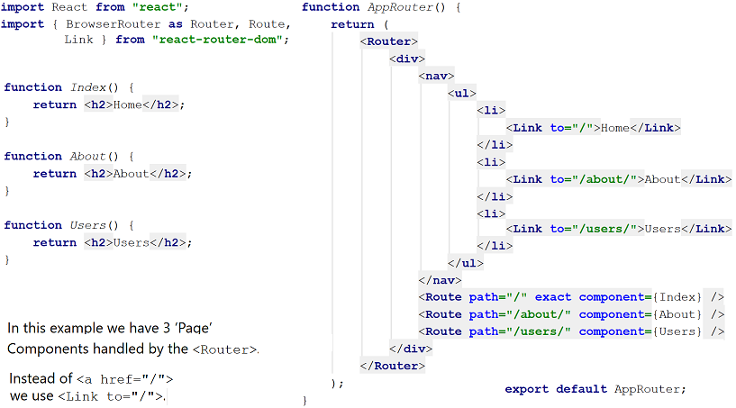
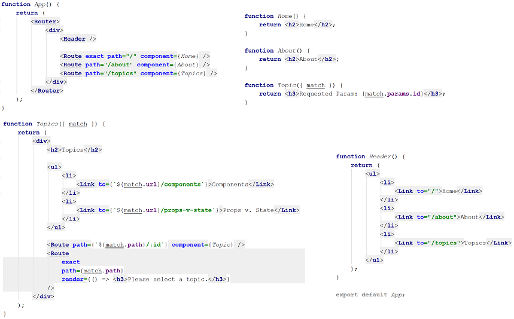

**[Examples and Guides](https://reacttraining.com/react-router/web)**

**Basic**

**Nested example**

**Passing props**

    <Route exact path='/' render={props => <Home {...props} />} />

Those props passed in `render` indicate as `route-props` which provides you `match`, `location` and `history` objects through which you can route through components or utilize those objects way you want in child components(if passed through props).

`{...props}` supplies all the properties it has in object.
Here `{...props}` will yield to `match`, `location` and `history` passed to component in `render`

**Further example**

    <Route
      path='/dashboard'
      render={(props) => <Dashboard {...props} isAuthed={true} />}
    />