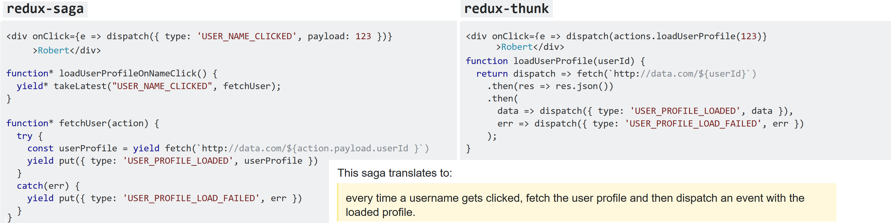

`redux-saga` helps manage side effects in your application which relate to data fetching, concurrent computations etc.

Imagine there is widget1 and widget2. Instead of coupling the 2 widgets together
(ie widget1 dispatch an action that targets widget2), widget1 only dispatch that its button was
clicked. Then the saga listen for this button click and then updates widget2 by dispatching a
new event that widget2 is aware of.

It makes it more easy to scale complex applications since these two widgets can live separately,
and would never have to share a global registry
of actions. They could be reused in other apps as well. The saga is the coupling point
between the two widgets that coordinate them in a meaningful way for your business.

***

    export function* loginSaga() {
      while(true) {
        const { user, pass } = yield take(LOGIN_REQUEST)
        try {
          let { data } = yield call(request.post, '/login', { user, pass });
          yield fork(loadUserData, data.uid);
          yield put({ type: LOGIN_SUCCESS, data });
        } catch(error) {
          yield put({ type: LOGIN_ERROR, error });
        }
      }
    }

Notice that we're calling the api functions using the form `yield call(func, ...args)`. `call`
doesn't execute the effect, it just creates a plain object like `{type: 'CALL', func, args}`. The
execution is delegated to the redux-saga middleware which takes care of executing the function and
resuming the generator with its result. The main advantage is that you can test the
generator outside of Redux using simple equality checks:

    const iterator = loginSaga()
    assert.deepEqual(iterator.next().value, take(LOGIN_REQUEST))

Also notice the call to `yield take(ACTION)`. Thunks are called by the action creator on each new
action (e.g. `LOGIN_REQUEST`). i.e. actions are continually *pushed* to thunks, and thunks have no
control on when to stop handling those actions.

In redux-saga, generators *pull* the next action. i.e. they have control when to listen for some
action, and when to not. In the above example the flow instructions are placed inside
a `while(true)` loop, so it'll listen for each incoming action. The pull approach allows
implementing complex control flows. [Example](https://stackoverflow.com/a/34933395/7159945)
user login functionality.

***
Imagine an app with a link to a user profile. The idiomatic way to handle this with both
middlewares would be:

The usage of `takeLatest` expresses that you only want to get the
data of the last username clicked (handle concurrency problems in case the user
click very fast on a lot of usernames). This would be hard with thunks.
You could have used takeEvery if you don't want this behavior.

You keep action creators pure and your code becomes much more testable as the effects
are declarative. Your UI just needs to dispatch what *has happened*. We only fire events
(always in the past tense) and not actions anymore. This allows for decoupling where
the saga can act as the coupling point between modular components.

***
