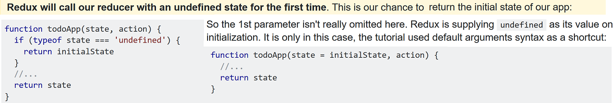
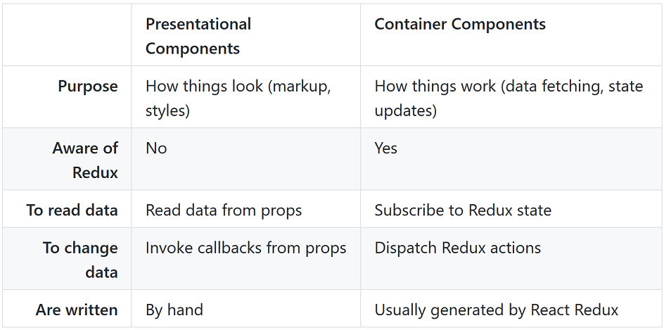
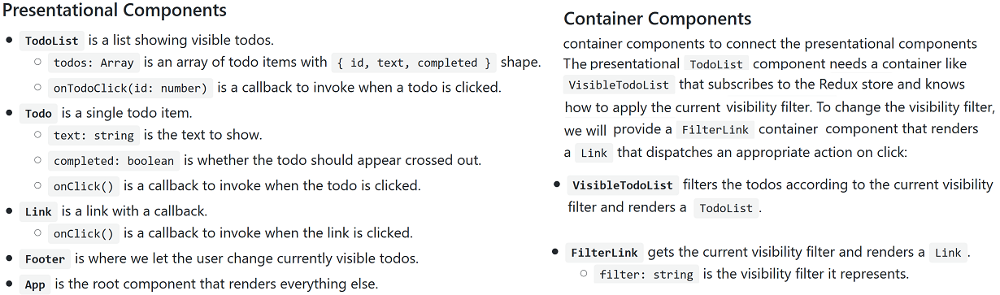

Redux
-----
[Cheatsheet](https://devhints.io/redux). 3 principles: A single source of truth. State is read-only. State is updated using pure functions

Regarding the default parameter in `myReducer` above:

A store holds the whole state tree of your application. The only way to change the state inside it is to dispatch an action on it.
A store is just an object with a few methods on it. To create it, pass your root reducing function to `createStore`.

In Redux, all the application state is stored as a single object. It's a good idea to think of its shape before writing any code.
What's the minimal representation of your app's state as an object?

In a more complex app, it's important to keep your state as normalized as possible, without any nesting. Keep every entity in an
object stored with an ID as a key, and use IDs to reference it from other entities, or lists. Think of the app's state as a database.
For example, keeping `todosById: { id -> todo }` and `todos: array<id>` inside the state would be a better idea in a real app

It's very important that the reducer stays pure (always returns the same result given the same inputs, and
doesn't cause any side effects). Things you should never do inside a reducer: mutate its argument,
perform side effects like API calls, call non-pure functions, e.g. `Date.now()` or `Math.random()`.

The reasoning behind this is it makes your reducers predictable - you know that, given an action with a
certain payload,
you're guaranteed to have the same output. This makes your app both easier to understand as a developer, and easier to unit test.
If you want to perform side effects when an action takes place, you should install a middleware that allows you to do so - e.g. redux-thunk,
which allows you to dispatch functions that can in turn dispatch actions (commonly used to make API calls)

So far we've learned about actions: things you `dispatch()` to a store to change its state.
Actions are dispatched whenever an event happens e.g., button clicked, page has finished loading, AJAX call has returned data.

    store.dispatch({ type: 'PUBLISH' })

Actions are objects and by convention always have a `type` key.

    const INITIAL_STATE = 0

    function increase() {
      return { type: 'INCREASE' }
    }

    function decrease() {
      return { type: 'DECREASE' }
    }

    function counterReducer(state = INITIAL_STATE, action = {}) {
      switch (action.type) {
        case INCREASE:
          return state + 1
        case DECREASE:
          return state - 1
        default:
          return state
      }
    }

    let { createStore, combineReducers } = Redux
    const rootReducer = combineReducers({ counter: counterReducer })
    const store = createStore(rootReducer)

    store.subscribe(() => {
      ReactDOM.render(
        

          <pre>
            { JSON.stringify(store.getState(), null, 2) }
          </pre>
          <button
            onClick={ () => store.dispatch(increase()) }>
            Increase
          </button>
      
,
        document.getElementById('root')
      )
    })

**Actions and Reducers - Key Points**

Divide application into high-level stateful components and low-level stateless components.

Giving the Action a Name:

Define a constant to identify this action, can use a string initially, but use symbolic constants in namespaces eventually (? - n.b. Redux docs says strings are better as are serializable).  Types can be defined as constants and imported from another module.

    // constants.js
    export const SET_SEARCH_TERM = "SET_SEARCH_TERM";

Create an Action Object:

Define a function to create an object representing an action. Put this in `actions.js` (in a small demo app):

    import CHANGE_SEARCHTERM from 'constants'

    export const setSearchTerm = (text) =>  { type: CHANGE_SEARCHTERM, payload: text }

Handle the Action:

Create the complement to our action generator in `reducers.js`. A constant defining the initial state…
that is the default value of reducer function’s state argument…and an action that tells the function how to update state:

    import { CHANGE_SEARCHTERM } from 'actions'

    const initialState = {
      searchTerm: ''
    }

    const robotsSearch = (state=initialState, action={}) => {
      switch (action.type) {
        case CHANGE_SEARCHTERM:
          return {...state, searchTerm: action.payload}
        default:
          return state
      }
    }

    export default robotsSearch;

If our reducer doesn’t recognize the action, it does nothing, which makes it safe for us to chain reducers together
Reducer functions always return a new state object. May recycle parts of the old state, but *never* mutate state in place

Usage with React example
------------------------
Redux works especially well with React as it lets you describe UI as a function of state, and Redux emits state updates in response to actions.
React bindings are not included in Redux by default. You need to install them explicitly: `npm install --save react-redux`

The follow example is not a Redux-specific task, but demonstrates usage:

`components/Todo.js` - an example of a presentational component:

    import React from 'react'
    import PropTypes from 'prop-types'

    const Todo = ({ onClick, completed, text }) => (
      <li
        onClick={onClick}
        style={{
          textDecoration: completed ? 'line-through' : 'none'
        }}
      >
        {text}
      </li>
    )

    Todo.propTypes = {
      onClick: PropTypes.func.isRequired,
      completed: PropTypes.bool.isRequired,
      text: PropTypes.string.isRequired
    }

    export default Todo

...and `components/TodoList.js`:

    import React from 'react'
    import PropTypes from 'prop-types'
    import Todo from './Todo'

    const TodoList = ({ todos, onTodoClick }) => (
      <ul>
        {todos.map((todo, index) => (
          <Todo key={index} {...todo} onClick={() => onTodoClick(index)} />
        ))}
      </ul>
    )

    TodoList.propTypes = {
      todos: PropTypes.arrayOf(
        PropTypes.shape({
          id: PropTypes.number.isRequired,
          completed: PropTypes.bool.isRequired,
          text: PropTypes.string.isRequired
        }).isRequired
      ).isRequired,
      onTodoClick: PropTypes.func.isRequired
    }

    export default TodoList

...other presentational components omitted for brevity.

Container components

Technically, a container component is just a React component that uses `store.subscribe()` to read a part of the
Redux state tree and supply props to a presentational component it renders.

It is recommended to generate container components using the React Redux library's `connect()` function,
which provides many useful optimizations to prevent unnecessary re-renders. (One result of this is that you
shouldn't have to worry about the React performance suggestion of implementing `shouldComponentUpdate` yourself.)
`connect` is just a React specific abstraction over `subscribe`.

To use `connect()`, you need to define a special function called `mapStateToProps` that describes how to
transform the current Redux store state into the props you want to pass to a presentational component you
are wrapping. For example, `VisibleTodoList` needs to calculate `todos` to pass to the `TodoList`, so we define a
function that filters the `state.todos` according to the`state.visibilityFilter`, and use it in its `mapStateToProps`:

    const getVisibleTodos = (todos, filter) => {
      switch (filter) {
        case 'SHOW_COMPLETED':
          return todos.filter(t => t.completed)
        case 'SHOW_ACTIVE':
          return todos.filter(t => !t.completed)
        case 'SHOW_ALL':
        default:
          return todos
      }
    }

    const mapStateToProps = state => {
      return {
        todos: getVisibleTodos(state.todos, state.visibilityFilter)
      }
    }

In addition to reading the state, container components can dispatch actions. In a similar fashion, you can
define a function called `mapDispatchToProps()` that receives the `dispatch()` method and returns callback props
that you want to inject into the presentational component. For example, we want the `VisibleTodoList` to inject
a prop called `onTodoClick` into the `TodoList` component, and we want `onTodoClick` to dispatch a `TOGGLE_TODO` action:

    const mapDispatchToProps = dispatch => {
      return {
        onTodoClick: id => {
          dispatch(toggleTodo(id))
        }
      }
    }

Finally, we create the `VisibleTodoList` by calling `connect()` and passing these two functions:

    import { connect } from 'react-redux'

    const VisibleTodoList = connect(
      mapStateToProps,
      mapDispatchToProps
    )(TodoList)

    export default VisibleTodoList

Passing the Store

All container components need access to the Redux store so they can subscribe to it.
One option would be to pass it as a prop to every container component. However it gets tedious.
Instead, use a special React Redux component called `<Provider>` to magically make the store available
to all container components in the application without passing it explicitly. You only need to use it once
when you render the root component:

    // index.js
    ...
    import { Provider } from 'react-redux'
    import { createStore } from 'redux'
    import todoApp from './reducers'

    const store = createStore(todoApp)
    // redux-thunk: const store = createStore(rootReducer, applyMiddleware(thunk));

    render(
      <Provider store={store}>
        <App />
      </Provider>,
      document.getElementById('root')
    )
