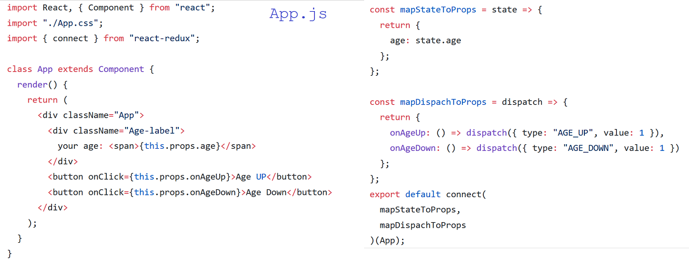
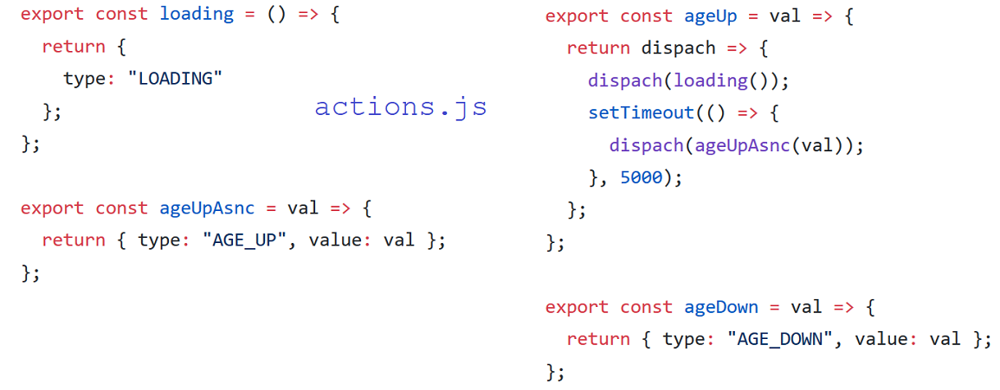
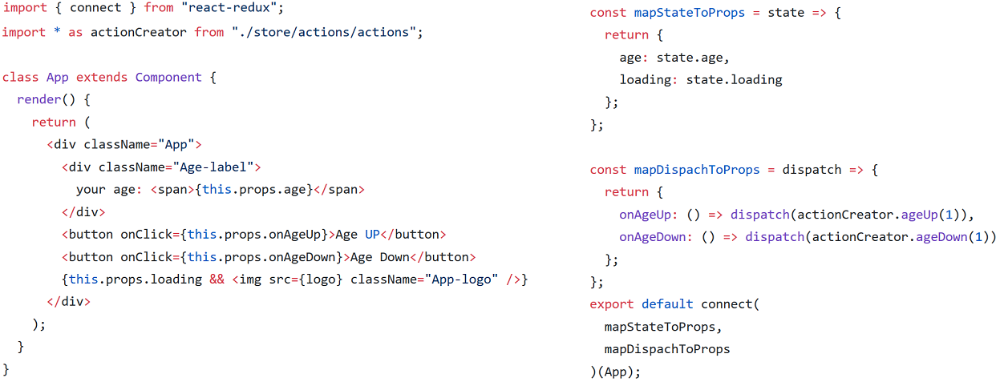
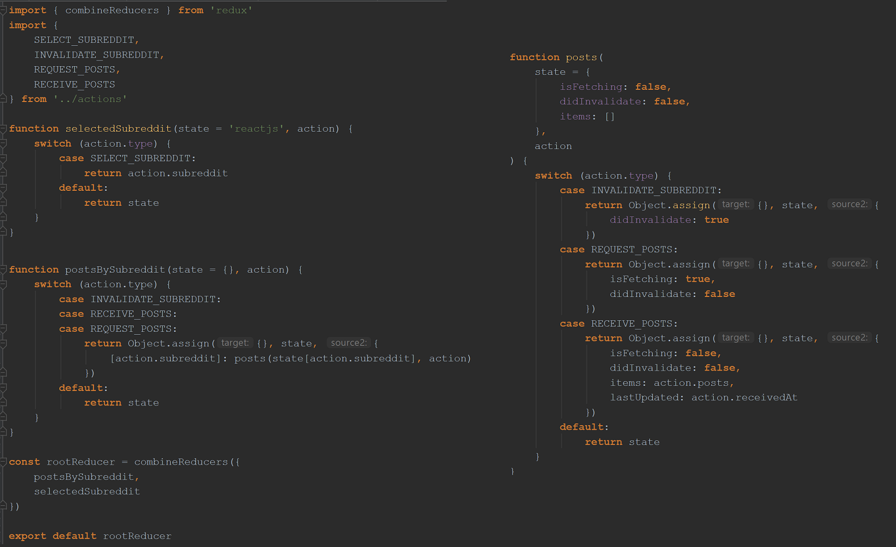
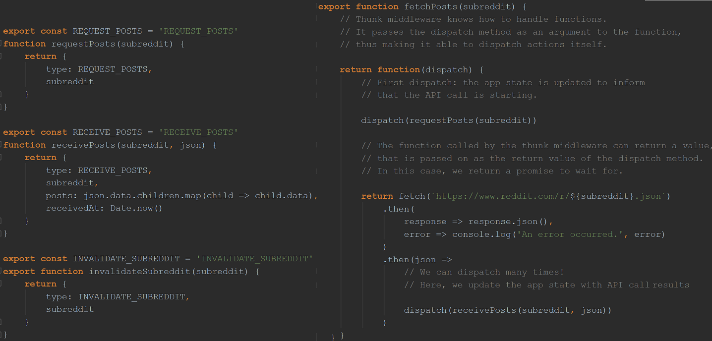

Async actions and `applyMiddleware`
-----------------------------------

An example of an async action would be a user clicking on some button to change something in his profile.
So this involves saving this to the server, and once this async action is done/save confirmed, the state should be updated.
n.b. in the case of an error state would be in accordance.

To add the middleware, we need to go to index.js where we create our store, import `applyMiddleware` from redux and pass it to `createStore`
Middleware e.g. redux-thunk, lets you capture some action and do something with it before dispatching to the store.

https://redux.js.org/advanced/async-actions

**redux-thunk**

A principle of Redux (listed in the introduction section of the docs) is that 'changes are made with pure functions'.

Three states in an *asynchronous* process (e.g. AJAX request):

    store.dispatch({ type: 'LOAD_START' })
    fetch('/data.json')
      .then(data =>
        store.dispatch({ type: 'LOAD_FINISH', data: data }))
      .catch(error =>
        store.dispatch({ type: 'LOAD_ERROR', error: error }))

Let's try putting this logic in the reducer. Let's add `fetch()` into it.

    function reducer (state, action) {
      if (action.type === 'LOAD_START') {
        fetch('/data.json').then(??).catch(??)
        return { ...state, loading: true }  } else { return state } }
    createStore(reducer)

It seems you can't `dispatch()` inside a reducer!

This is how Redux was designed. Reducers only define how to move from one state to another; it can't have side effects.

† The “vanilla” store implementation you get by calling `createStore` only supports plain object actions and
hands them immediately to the reducer.

However, if you wrap createStore with `applyMiddleware`, the middleware can interpret actions differently,
and provide support for dispatching async actions. Async actions are usually asynchronous primitives like Promises, Observables, or thunks.

Meet redux-thunk, a Middleware, or a plugin that extends `dispatch()` to do more things.

    import reducer from "./store/reducers/reducer";
    import { Provider } from "react-redux";
    import { createStore, applyMiddleware } from 'redux'
    import thunk from 'redux-thunk'

    store = createStore(reducer, applyMiddleware(thunk))

    ReactDOM.render(
      <Provider store={store}>
        <App />
      </Provider>,
      document.getElementById("root")
    );

redux-thunk allows you to dispatch functions that can in turn dispatch actions (commonly used to make API calls):

thunk - statement wrapped with a function, so later call the function to return that statement to be executed.
So instead of dispatching action an right there, wrap it with a function (a thunk), then we call that function
to return those actions.

Consider this minimal React-Redux `App.js`:

To use redux-thunk middleware, firstly write our actions in `actions.js` which which we will later use in `App.js`:

When the above 'ageUp' function runs after a button click, the action gets dispatched and then it gets caught by 'ageUp' function
which catches the action then after the timeout dispatches another action which then reaches the reducer.

Now we can import our `actionCreators` and use them in our `mapDispatchToProps` (the second argument passed to `connect`, and used for dispatching actions):

Recap on middleware:

Asynchronous middleware like redux-thunk or redux-promise wraps the store's `dispatch()` method and allows you to
dispatch something other than actions, for example, functions or Promises. Any middleware you use can then intercept
anything you dispatch, and in turn, can pass actions to the next middleware in the chain. For example, a Promise
middleware can intercept Promises and dispatch a pair of begin/end actions asynchronously in response to each Promise.
When the last middleware in the chain dispatches an action, it has to be a plain object.

Redux Docs Async Actions
------------------------
When you call an asynchronous API, the moment you start the call, and the moment when you receive an answer (or a timeout),
each will usually require a change in the application state.
To do that, you need to dispatch normal actions that will be processed by reducers synchronously.

This would involve at least three different kinds of actions to inform the reducer that either:

- The request began. Reducers may handle this action by toggling an `isFetching` flag in the state so the UI knows to show a spinner.

- The request finished successfully. May be handled by reducers by merging the new data into the state they manage and resetting `isFetching`.
The UI would hide the spinner, and display the fetched data.

- That the request failed. This action may be handled by resetting `isFetching`. Additionally, some reducers may want to store the error message so the UI can display it.

You may use a dedicated status field in your actions:

    { type: 'FETCH_POSTS' }
    { type: 'FETCH_POSTS', status: 'error', error: 'Oops' }
    { type: 'FETCH_POSTS', status: 'success', response: { ... } }

Or you can define separate types for them:

    { type: 'FETCH_POSTS_REQUEST' }
    { type: 'FETCH_POSTS_FAILURE', error: 'Oops' }
    { type: 'FETCH_POSTS_SUCCESS', response: { ... } }

Before rushing into the implementation, it's important to consider the shape of the application's state. E.g. for a 'Reddit Headlines' app:

    { selectedSubreddit: 'frontend',
      postsBySubreddit: {
        frontend: {
          isFetching: true,
          didInvalidate: false,
          items: []
        },
        reactjs: {
          isFetching: false,
          didInvalidate: false,
          lastUpdated: 1439478405547,
          items: [
            {id: 42, title: 'Confusion about Flux and Relay'},
            {id: 500, ...

For every list of items, you'll want to store `isFetching` to show a spinner, `didInvalidate`
so you can later toggle it when the data is stale,
In a real app, you'll also want to store pagination state like `fetchedPageCount` and `nextPageUrl`.

**Handling Actions**

In `reducers.js` we write functions which manage part of the state. Below we extract `posts(state, action)` that manages
the state of a specific post list. This is just reducer composition! It is our choice how to split the reducer into
smaller reducers, and in this case, we're delegating updating items inside an object to a `posts` reducer.

Remember that reducers are just functions, so you can use functional composition and higher-order functions.
`combineReducers()`, as described in  [Splitting Reducers](https://redux.js.org/basics/reducers#splitting-reducers) in the docs.

n.b. instead of `Object.assign()`, could use nicer object spread syntax  e.g. `{ ...state, didInvalidate: true}`

**Async Action Creators**

By using Redux Thunk middleware, an action creator can return a function instead of an action object.
This way, the action creator becomes a thunk.

When an action creator returns a function, that function will get executed by the middleware.
This function doesn't need to be pure; it is thus allowed to have side effects, including executing asynchronous API calls.
The function can also dispatch synchronous actions. Define these special thunk action creators inside our `actions.js` file:

[Link](https://redux.js.org/advanced/async-actions#actionsjs-with-fetch) to example of a more sophisticated async control flow:

How to dispatch a Redux action with a timeout?
----------------------------------------------
[Stackoverflow link.](https://stackoverflow.com/questions/35411423/how-to-dispatch-a-redux-action-with-a-timeout/35415559#35415559)
Unless you realize you are repeating too much code, use what the language offers and go for the simplest solution.

**Writing Async Code Inline** (by far the simplest way)

    store.dispatch({ type: 'SHOW_NOTIFICATION', text: 'You logged in.' })
    setTimeout(() => {
      store.dispatch({ type: 'HIDE_NOTIFICATION' })
    }, 5000)

Similarly, from inside a connected component (only difference is that in a connected component you usually don’t
have access to the store itself, but get either `dispatch()` or specific action creators injected as props):

    this.props.dispatch({ type: 'SHOW_NOTIFICATION', text: 'You logged in.' })
    setTimeout(() => {
      this.props.dispatch({ type: 'HIDE_NOTIFICATION' })
    }, 5000)

If you are worried about typos when dispatching the same actions from different components, you might want to
extract action creators instead of dispatching action objects inline:

    // actions.js
    export function showNotification(text) {
      return { type: 'SHOW_NOTIFICATION', text }
    }
    export function hideNotification() {
      return { type: 'HIDE_NOTIFICATION' }
    }

    // component.js
    import { showNotification, hideNotification } from '../actions'

    this.props.dispatch(showNotification('You just logged in.'))
    setTimeout(() => {
      this.props.dispatch(hideNotification())
    }, 5000)

Or, if you have previously bound them with connect():

    this.props.showNotification('You just logged in.')
    setTimeout(() => {
      this.props.hideNotification()
    }, 5000)

**Extracting Async Action Creator**

The approach above works fine in simple cases but you might find that it has a few problems:
- It forces you to duplicate this logic anywhere you want to show a notification.
- The notifications have no IDs so you’ll have a race condition if you show two notifications fast enough.

Solve this by extracting a function that centralizes the timeout logic and dispatches those two actions:

    // actions.js
    function showNotification(id, text) {
      return { type: 'SHOW_NOTIFICATION', id, text }
    }
    function hideNotification(id) {
      return { type: 'HIDE_NOTIFICATION', id }
    }

    let nextNotificationId = 0
    export function showNotificationWithTimeout(dispatch, text) {
      // Assigning IDs to notifications lets reducer ignore HIDE_NOTIFICATION
      // for the notification that is not currently visible.
      const id = nextNotificationId++
      dispatch(showNotification(id, text))

      setTimeout(() => {
        dispatch(hideNotification(id))
      }, 5000)
    }

    // component.js
    showNotificationWithTimeout(this.props.dispatch, 'You just logged in.')

    // otherComponent.js
    showNotificationWithTimeout(this.props.dispatch, 'You just logged out.')

**Thunk Middleware**

Don’t worry about middleware if you can get by without it. In larger apps, however, you might find certain
inconveniences around the above approach. E.g. it seems unfortunate that we have to pass dispatch around.
You can’t just bind action creators with `connect()` anymore because `showNotificationWithTimeout()` is not
really an action creator (doesn't return a Redux action).
In addition, it can be awkward to remember which functions are synchronous action creators and which are
asynchronous helpers. You have to use them differently and be careful not to mistake them with each other.

This was the motivation for finding a way to “legitimize” this pattern of providing dispatch to a helper
function, and help Redux “see” such asynchronous action creators as a special case of normal action creators.
When Redux middleware is enabled,any time you attempt to dispatch a function instead of an action object,
Redux Thunk middleware will call that function with dispatch method itself as the first argument.

This function is almost identical to the one written previously except that it doesn’t accept `dispatch` as
the first argument. Instead it returns a function that accepts `dispatch` as the first argument:

    // actions.js
    function showNotification(id, text) {
      return { type: 'SHOW_NOTIFICATION', id, text }
    }
    function hideNotification(id) {
      return { type: 'HIDE_NOTIFICATION', id }
    }

    let nextNotificationId = 0
    export function showNotificationWithTimeout(text) {
      return function (dispatch) {
        const id = nextNotificationId++
        dispatch(showNotification(id, text))

        setTimeout(() => {
          dispatch(hideNotification(id))
        }, 5000)
      }
    }

Since if we dispatch a function instead of an action object, the middleware will call that function with dispatch
method itself as the first argument, we can do this:

    // component.js
    import { connect } from 'react-redux'

    // ...
    this.props.showNotificationWithTimeout('You just logged in.')
    // ...

    export default connect(
      mapStateToProps,
      { showNotificationWithTimeout }
    )(MyComponent)

Finally, we have abstracted away the difference between dispatching a synchonous and an asynchronous action.
Also, notice that since we “taught” Redux to recognize such “special” action creators (we call them thunk
action creators), we can now use them in any place where we would use regular action creators. E.g. we can
use them with `connect()`.

**How to show a loading indicator in React Redux app while fetching the data?**

Loading indicators are a great case of UI that is easily described as a function of state: in this case,
of a boolean variable. The followingreducer updates a field called `isFetching`:

    case REQUEST_POSTS:
      return Object.assign({}, state, {
        isFetching: true,
        didInvalidate: false
      })

    case RECEIVE_POSTS:
      return Object.assign({}, state, {
        isFetching: false,
        didInvalidate: false,
        items: action.posts,
        lastUpdated: action.receivedAt

A component that uses `connect()` from React Redux to subscribe to the store’s state
and returns isFetching as part of the `mapStateToProps()` return value so it is available
in the connected component’s props.

Finally, the component uses `isFetching` prop in the `render()` function to render a “Loading...” label (which could conceivably be a spinner instead):

    {isEmpty
      ? (isFetching ? <h2>Loading...</h2> : <h2>Empty.</h2>)
      : 

          <Posts posts={posts} />
        

    }

