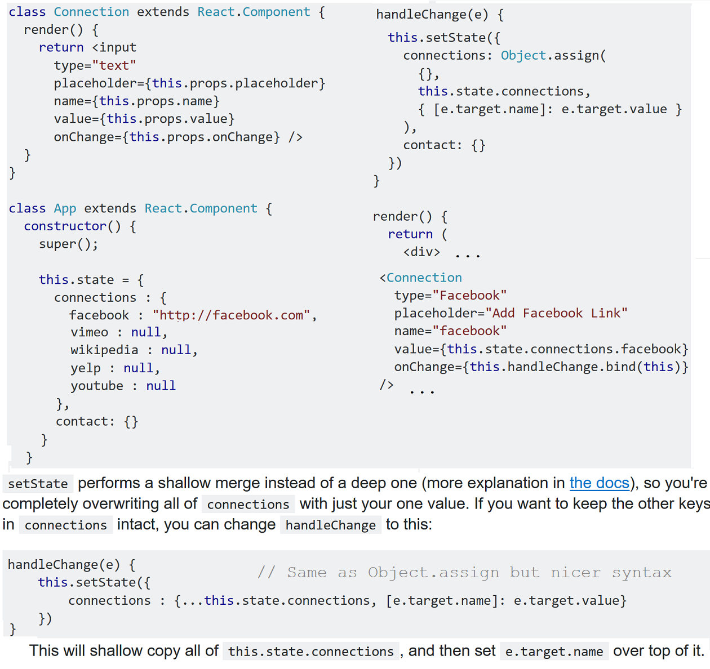
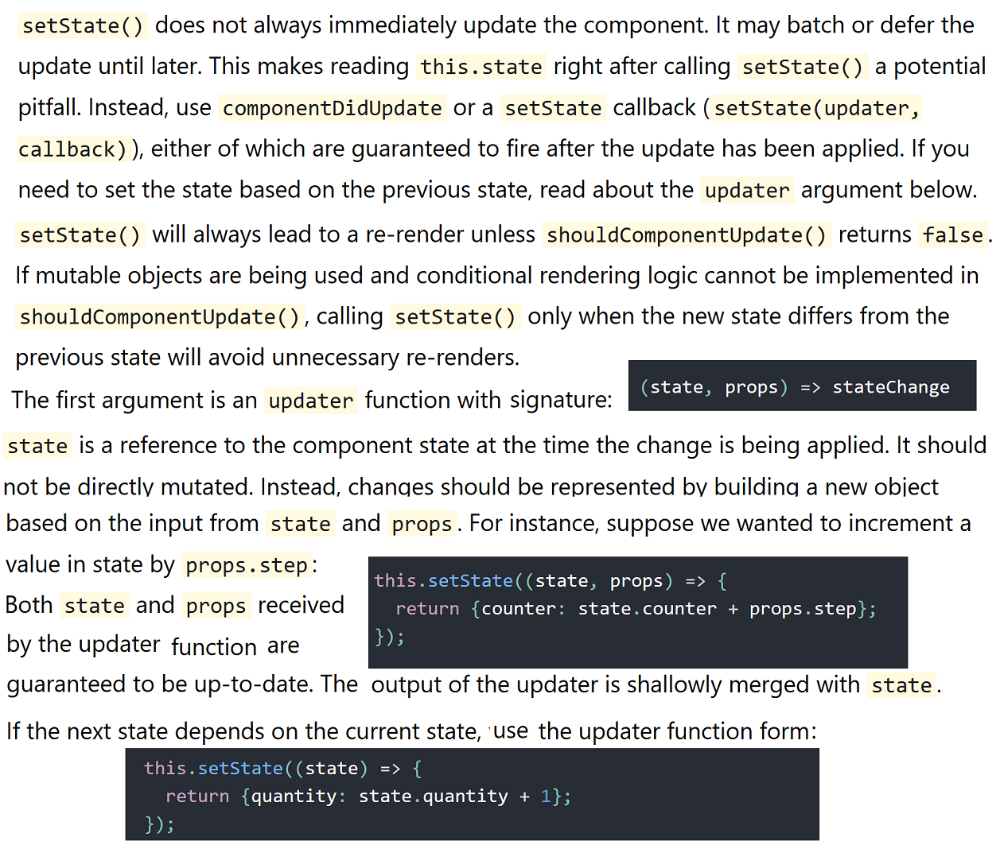

**`setState()`**

**Access previous state in `setState()`**

You cannot always trust `this.state` to hold the correct state immediately after calling `setState()`, as it is always equal
to the state rendered on the screen.

Classic example is the click handler function in a counter component where an updater function needs to be used to correctly increment the count:

    changeCount = () => {
      this.setState((prevState) => {
        return { count: prevState.count - 1}
      })
    }

**Updating state with values that depend on the current state**

Pass a function instead of an object to `setState` to ensure the call always uses the most updated version of state

    incrementCount() {
      // Note: this will *not* work as intended.
      this.setState({count: this.state.count + 1});
    }

React doesn't update `this.state.count` until the component is re-rendered.
So above, `incrementCount()` ends up reading `this.state.count` as 0 every time.

Passing an update function allows you to access the current state value inside the updater. Since `setState` calls are batched, this lets you chain updates and ensure they build on top of each other instead of conflicting:

    incrementCount() {
      this.setState((state) => {
        // Important: read `state` instead of `this.state` when updating.
        return {count: state.count + 1}
      });
    }

*Currently*, `setState` is asynchronous inside event handlers. React *flushes* the state updates at the end of the browser event.

**Actions on state, where state is considered immutable**

Adding or Updating the value of a property:

    function updateState(state, item) {
      return {
         ...state,
         [item.id]: item
      };
    }

Note: `[item.id]` is computed property name syntax.

Deleting a property:

    function deleteProperty(state, id) {
        let  {[id]: deleted, ...newState} = state;
        return newState;
    }

Or even shorter as helper function:

    function deleteProperty({[id]: deleted, ...newState}, id) {
        return newState;
    }

    function deleteProperty(state, id) {
        return (({[id]: deleted, ...state}) => state)(state);
    }

**Execute a function after `setState` is finished updating**

`setState(updater[, callback])` is an async function. [Docs](https://facebook.github.io/react/docs/react-component.html#setstate)

You can execute a function after setState is finishing using the second param callback like:

    this.setState({
        someState: obj}, this.afterSetStateFinished;
    });

