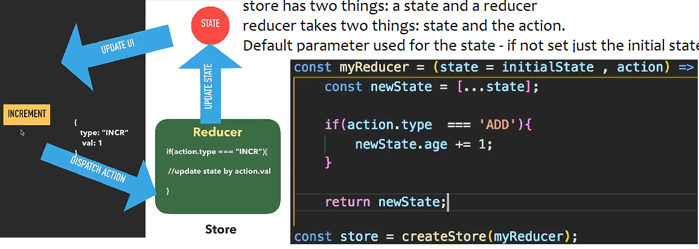
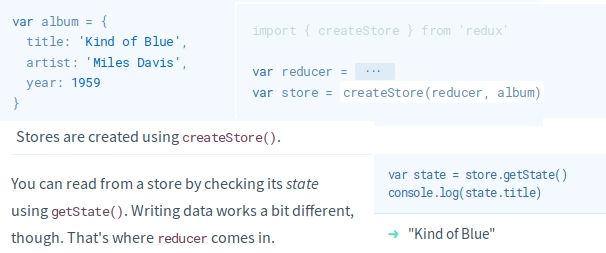
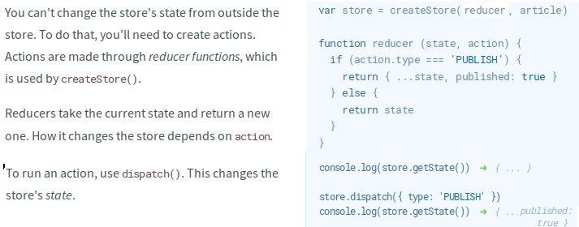
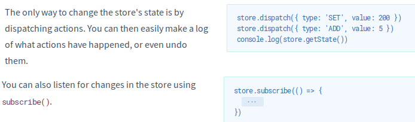
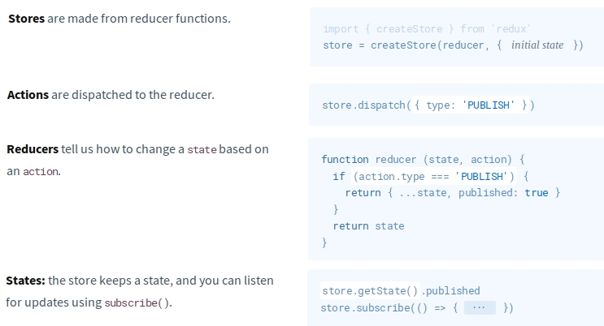

**Updating state with values that depend on the current state**

Pass a function instead of an object to `setState` to ensure the call always uses the most updated version of state

    incrementCount() {
      // Note: this will *not* work as intended.
      this.setState({count: this.state.count + 1});
    }

React doesn't update `this.state.count` until the component is re-rendered.
So above, `incrementCount()` ends up reading `this.state.count` as 0 every time.

Passing an update function allows you to access the current state value inside the updater. Since `setState` calls are batched, this lets you chain updates and ensure they build on top of each other instead of conflicting:

    incrementCount() {
      this.setState((state) => {
        // Important: read `state` instead of `this.state` when updating.
        return {count: state.count + 1}
      });
    }

*Currently*, `setState` is asynchronous inside event handlers. React �flushes� the state updates at the end of the browser event.

Redux
-----
[Cheatsheet](https://devhints.io/redux). 3 principles: A single source of truth. State is read-only. State is updated using pure functions

So far we've learned about actions: things you `dispatch()` to a store to change its state.
Actions are dispatched whenever an event happens e.g., button clicked, page has finished loading, AJAX call has returned data.

    store.dispatch({ type: 'PUBLISH' })

Actions are objects and by convention always have a `type` key.

    const INITIAL_STATE = 0

    function increase() {
      return { type: 'INCREASE' }
    }

    function decrease() {
      return { type: 'DECREASE' }
    }

    function counterReducer(state = INITIAL_STATE, action = {}) {
      switch (action.type) {
        case INCREASE:
          return state + 1
        case DECREASE:
          return state - 1
        default:
          return state
      }
    }

    let { createStore, combineReducers } = Redux
    const rootReducer = combineReducers({ counter: counterReducer })
    const store = createStore(rootReducer)

    store.subscribe(() => {
      ReactDOM.render(
        

          <pre>
            { JSON.stringify(store.getState(), null, 2) }
          </pre>
          <button
            onClick={ () => store.dispatch(increase()) }>
            Increase
          </button>
      
,
        document.getElementById('root')
      )
    })

**redux-thunk**

Three states in an *asynchronous* process (e.g. AJAX request):

    store.dispatch({ type: 'LOAD_START' })
    fetch('/data.json')
      .then(data =>
        store.dispatch({ type: 'LOAD_FINISH', data: data }))
      .catch(error =>
        store.dispatch({ type: 'LOAD_ERROR', error: error }))

Let's try putting this logic in the reducer. Let's add `fetch() into it.

    function reducer (state, action) {
      if (action.type === 'LOAD_START') {
        fetch('/data.json').then(??).catch(??)
        return { ...state, loading: true }  } else {     return state   } }
    createStore(reducer)

It seems you can't `dispatch()` inside a reducer! This is how Redux was designed. Reducers only define how to move from one state to another; it can't have side effects.

Meet redux-thunk, a Middleware, or a plugin that extends `dispatch()` to do more things.

    import thunk from 'redux-thunk'
    import { createStore, applyMiddleware } from 'redux'

    store = createStore(reducer, {}, applyMiddleware(thunk))
    function load (dispatch, getState) {
      ...
    }
    store.dispatch(load)

