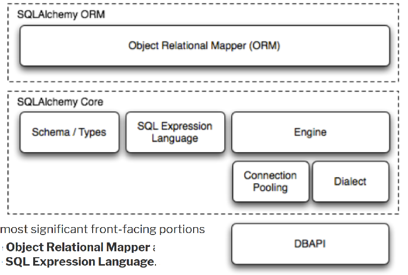
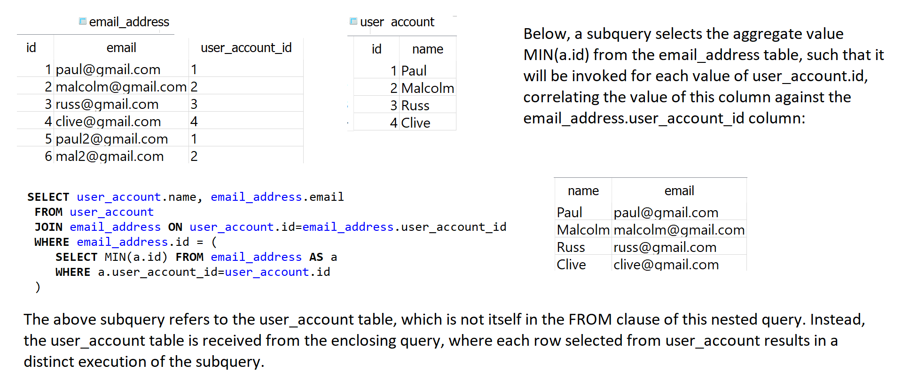

SQLAlchemy has several distinct areas of functionality which can be used individually or combined together. Its major components are illustrated below, with component dependencies organized into layers:

Expressions can be used independently of the ORM. When using the ORM, the SQL Expression language remains part of the public facing API

The SQLAlchemy Expression Language provides a system for the programmers to write "SQL statements" using Python constructs. These constructs are modeled to resemble those of the underlying database as closely as possible, while hiding the difference between various database backends from the user...backend-neutral expressions, while allowing the programmers to take advantage of specific backend features if they really want to.
The Expression Language complements the Object Relational Mapper. Whereas the ORM presents an abstracted pattern of usage mapping database concepts into Python's space, where models are used to map tables and relationships are used to map many-to-many through an association table and one-to-one through a foreign key, the Expression Language is used to directly represent more primitive constructs in a database without opinion.
Expression Language is more flexible than the ORM and its queries can be mapped into selectable SQL views in Python, which is very helpful as our queries become more and more complex.

**SQLAlchemy ORM**

If you want to work with higher-level SQL which is constructed automatically for you, as well as automated persistence of Python objects

Complex application-side logic. Transaction. Business logic, APIs, web

**SQLAlchemy Core**

In contrast to the ORM’s domain-centric mode of usage, the SQL Expression Language provides a schema-centric usage paradigm.

Large inserts, updates, deletes. Complex queries.

**Using SQL Expression Language to complement the ORM**

    class Department(Base):
        __tablename__ = 'department'
        id = Column(Integer, primary_key=True)
        name = Column(String)

    class Employee(Base):
        __tablename__ = 'employee'
        id = Column(Integer, primary_key=True)
        name = Column(String)
        department_id = Column(Integer, ForeignKey('department.id'))
        department = relationship(Department, backref=backref('employees', uselist=True))

    engine = create_engine('sqlite:///')
    session = sessionmaker(bind=engine)
    Base.metadata.create_all(engine)

    john = Employee(name='john')
    it_department = Department(name='IT')
    john.department = it_department
    s = session()
    s.add(john)
    s.add(it_department)
    s.commit()

    it = s.query(Department).filter(Department.name == 'IT').one()
    print(it.employees[0].name)
    # john

    find_it = select([Employee.name]).where(Department.name == 'IT')
    rs = s.execute(find_it)
    print(rs.fetchone())
    # ('john',)
    find_it2 = select([Department.name]).where(Employee.id == john.id)
    rs2 = s.execute(find_it2)
    print(rs2.fetchone())
    # ('IT', 1)

Example 2 - We have one user, three products and two shopping carts in the database, we can start playing with the expression language. First, let's write a query to answer the question: which products' prices are higher than $100.00?

    >>> engine = create_engine('sqlite:///:memory:', echo=True)
    >>> Session = sessionmaker(bind=engine)
    >>> session = Session()
    >>> product_higher_than_one_hundred = select([Product.id]).where(Product.price > 100.00)
    >>> session.query(Product).filter(Product.id.in_(product_higher_than_one_hundred)).all()
    [( :u'CPU':300.0 ), ( :u'Motherboard':150.0 )]

Which shopping carts contain at least one product whose price is higher than $100.00?

    >>> shopping_carts_with_products_higher_than_one_hundred = select([ShoppingCart.id]).where(
    ...     ShoppingCart.products.any(Product.id.in_(product_higher_than_one_hundred))
    ... )
    >>> session.query(ShoppingCart).filter(ShoppingCart.id.in_(shopping_carts_with_products_higher_than_one_hundred)).one()
    ( :John:[( :u'CPU':300.0 ), ( :u'Motherboard':150.0 )] )

To filter shopping carts that don't, add in the `not()` conjunction:

    >>> shopping_carts_with_no_products_lower_than_one_hundred = select([ShoppingCart.id]).where(
    ...     not_(ShoppingCart.products.any(Product.id.in_(products_lower_than_one_hundred)))
    ... )

Glossary
--------

**ACID model**

An acronym for “Atomicity, Consistency, Isolation, Durability”; a set of properties that guarantee that database transactions are processed reliably.

Atomicity requires that each transaction is “all or nothing”: if one part of the transaction fails, the entire transaction fails, and the database state is left unchanged

Consistency ensures that any transaction will bring the database from one valid state to another. Any data written to the database must be valid according to all defined rules, including but not limited to constraints, cascades, triggers, combinations thereof

Isolated: each transaction must execute in total isolation. i.e. if T1 and T2 execute concurrently then each should remain independent of the other.

Durability: once a transaction has been committed, it will remain so, even in the event of power loss, crashes, or errors.

**Association relationship**

Links two tables together using an association table in the middle (thereby allowing extra information to be stored). The many-to-many table is mapped by a full class, rather than invisibly handled by the `sqlalchemy.orm.relationship()` construct as in the case with many-to-many

A SQLAlchemy declarative mapping for the above might look like:

    class Employee(Base):
        __tablename__ = 'employee'

        id = Column(Integer, primary_key)
        name = Column(String(30))

    class Project(Base):
        __tablename__ = 'project'

        id = Column(Integer, primary_key)
        name = Column(String(30))

    class EmployeeProject(Base):
        __tablename__ = 'employee_project'

        employee_id = Column(Integer, ForeignKey('employee.id'), primary_key=True)
        project_id = Column(Integer, ForeignKey('project.id'), primary_key=True)
        role_name = Column(String(30))

        project = relationship("Project", backref="project_employees")
        employee = relationship("Employee", backref="employee_projects")

Employees can be added to a project given a role name:

    proj = Project(name="Client A")

    emp1 = Employee(name="emp1")
    emp2 = Employee(name="emp2")

    proj.project_employees.extend([
        EmployeeProject(employee=emp1, role="tech lead"),
        EmployeeProject(employee=emp2, role="account executive")
    ])

**Bidirectional relationship**

Where two distinct `relationship()` objects can be mutually associated with each other, such that they coordinate in memory as changes occur to either side. The most common way these two relationships are constructed is by using the `relationship()` function explicitly for one side and specifying the backref keyword to it so that the other `relationship()` is created automatically.

    class Department(Base):
        id = Column(Integer, primary_key=True)
        ...
        employees = relationship("Employee", backref="department")

    class Employee(Base):
        ...
        tn3w
        dep_id = Column(Integer, ForeignKey('department.id'))

**Candidate key**

An attribute or set of attributes that form a uniquely identifying key for a row. A row may have more than one candidate key, each of which is suitable for use as the primary key of that row. The primary key of a table is always a candidate key.

**Constraints**

Check constraint: defines valid data when adding or updating an entry in a table. A check constraint can be added to a table in standard SQL using DDL like the following:

    ALTER TABLE distributors ADD CONSTRAINT zipchk CHECK (char_length(zipcode) = 5);

**Correlated subqueries**

A subquery is correlated if it depends on data in the enclosing `SELECT`.

**DBAPI**

(Python Database API Specification) widely used specification within Python to define common usage patterns for all database connection packages. The DBAPI is a “low level” API which is typically the lowest level system used in a Python application to talk to a database. SQLAlchemy’s dialect system is constructed around the operation of the DBAPI, providing individual dialect classes which service a specific DBAPI on top of a specific database engine.
Nearly all Python database modules such as `sqlite3`, `psycopg` and `mysql-python` conform to this interface.

**DDL, DML,**

DDL is Data Definition Language: used to define data structures. E.g. instructions such as `create table`, `alter table`, ...

DML is Data Manipulation Language: used to manipulate data itself. E.g. instructions such as `insert`, `update`, `delete`, ...

**Descriptors**

In Python, a descriptor is an object attribute with “binding behavior”, one whose attribute access has been overridden by methods in the descriptor protocol. Those methods are `__get__()`, `__set__()`, and `__delete__()`. If any of those methods are defined for an object, it is said to be a descriptor.

In SQLAlchemy, descriptors are used heavily in order to provide attribute behavior on mapped classes. When a class is mapped as such:

    class MyClass(Base):
        __tablename__ = 'foo'

        id = Column(Integer, primary_key=True)
        data = Column(String)

The `MyClass` class will be mapped when its definition is complete, at which point the id and data attributes, starting out as `Column` objects, will be replaced by the instrumentation system with instances of `InstrumentedAttribute`, which are descriptors that provide the above mentioned `__get__()`, `__set__()` and `__delete__()` methods.

**FK Constraint**

A foreign key constraint can be added to a table in standard SQL using DDL like the following:

    ALTER TABLE employee ADD CONSTRAINT dep_id_fk
    FOREIGN KEY (employee) REFERENCES department (dep_id)

**FROM clause**

The portion of the SELECT statement which indicates the initial source of rows.

A simple SELECT will feature one or more table names in its FROM clause. Multiple sources are separated by a comma:

    SELECT user.name, address.email_address
    FROM user, address
    WHERE user.id=address.user_id

The FROM clause is also where explicit joins are specified. We can rewrite the above SELECT using a single FROM element which consists of a JOIN of the two tables:

    SELECT user.name, address.email_address
    FROM user JOIN address ON user.id=address.user_id

**Subqueries**

See [Writing efficient subqueries](#https://github.com/paulos84/snippets-exercises/blob/master/databases-notes/sql_queries.md).

A subquery is a SELECT statement within the WHERE or HAVING clause. Correlated Subquery is a sub-query that uses values from the outer query, so the inner query has to be executed for every row of the outer query.

A “scalar select” subquery returns exactly one row and one column. A correlated subquery (part of the rows which it selects from are given via the enclosing statement):

    SELECT id, (SELECT name FROM address WHERE address.user_id=user.id)
    FROM user

This subquery in this example is not correlated as it selects a fixed result:

    SELECT id, name FROM user
    WHERE status=(SELECT status_id FROM status_code WHERE code='C')

A derived table subquery placed in the `FROM` clause of an enclosing `SELECT`. Subquery is given an alias name:

    SELECT user.id, user.name, ad_subq.email_address
    FROM
        user JOIN
        (select user_id, email_address FROM address WHERE address_type='Q') AS ad_subq
        ON user.id = ad_subq.user_id

A subquery is correlated if it depends on data in the enclosing `SELECT`:

