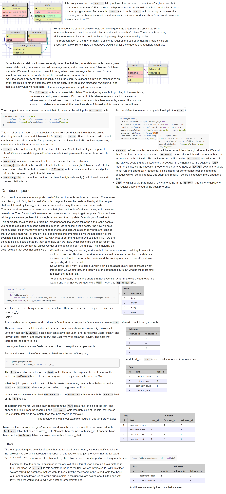

https://blog.miguelgrinberg.com/post/the-flask-mega-tutorial-part-viii-followers-contacts-and-friends-legacy

The following query returns the process_id value from the process table and then some values from multiple records from the table obj_property - if those records exist - correlated via an intermediate table route. Complex, but also fast!

    SELECT process.process_id, op1.value_int, op2.value_string, op3.value_string
    FROM process
      INNER JOIN route ON ( route.route_id = process.route_id )
      LEFT OUTER JOIN obj_property op1
        ON ( op1.obj_id = route.route_id AND
             op1.namespace_prefix = 'http://www.opengroupware.us/oie' AND
             op1.value_key = 'expireDays' )
      LEFT OUTER JOIN obj_property op2
        ON ( op2.obj_id = route.route_id AND
             op2.namespace_prefix = 'http://www.opengroupware.us/oie' AND
             op2.value_key = 'preserveAfterCompletion' )
      LEFT OUTER JOIN obj_property op3
        ON ( op3.obj_id = route.route_id AND
             op3.namespace_prefix = 'http://www.opengroupware.us/oie' AND
             op3.value_key = 'archiveAfterExpiration' )
    WHERE process.db_status != 'archived'
      AND process.state IN ( 'C', 'F', 'Z' )
      AND process.status != 'archived';

The SQLAlchemy `aliased()` method declares multiple references to `ObjectProperty` that can be used independently: `op1`, `op2`, and `op3`. The other advanced technique is to use the `outerjoin()` method to relate the need for a LEFT OUTER join.

    op1 = aliased(ObjectProperty)
    op2 = aliased(ObjectProperty)
    op3 = aliased(ObjectProperty)

    q = Session.query( Process, op1, op2, op3 ).\
           join( Route, Route.object_id == Process.route_id ).\
           outerjoin( op1, and_( op1.parent_id == Route.object_id,
                                 op1.namespace=='http://www.opengroupware.us/oie',
                                 op1.name=='expireDays' ), ).\
           outerjoin( op2, and_( op2.parent_id == Route.object_id,
                                 op2.namespace=='http://www.opengroupware.us/oie',
                                 op2.name=='preserveAfterCompletion' ), ).\
           outerjoin( op3, and_( op3.parent_id == Route.object_id,
                                 op3.namespace=='http://www.opengroupware.us/oie',
                                 op3.name=='archiveAfterExpiration' ), ).\
           filter( and_( Process.state.in_( [ 'C', 'F', 'Z' ] ),
                         Process.status != 'archived' ) )

The results of this query will be tuples of four elements; the first being a Process object and the second, third, and fourth will either be ObjectProperty objects if the concomitant outer join identified a record or None if no record matched the join. The lovely upside of this is that the query results can be processed using a straight forward for-each construct:

    for process, expire_days, preserve_after, archive_after in q.all():
       if expire_days:
           ....

IN clause
---------
I'm trying to do this query in sqlalchemy:

    SELECT id, name FROM user WHERE id IN (123, 456)

session.query(MyUserClass).filter(MyUserClass.id.in_((123,456))).all()

Subqueries
-----------

    SELECT *
    FROM Residents
    WHERE apartment_id IN (SELECT ID
                           FROM Apartments
                           WHERE postcode = 2000)

Use the [subquery](http://docs.sqlalchemy.org/en/rel_1_0/orm/query.html#sqlalchemy.orm.query.Query.subquery) method:

    subquery = session.query(Apartments.id).filter(Apartments.postcode==2000).subquery()
    query = session.query(Residents).filter(Residents.apartment_id.in_(subquery))

------------------------
    class User(db.Model):
        __tablename__ = 'users'
        user_id = db.Column(db.Integer, primary_key=True)

    class Posts(db.Model):
        __tablename__ = 'posts'
        post_id = db.Column(db.Integer, primary_key=True)
        user_id = db.Column(db.Integer, db.ForeignKey('users.user_id'))
        post_time = db.Column(db.DateTime)

        user = db.relationship('User', backref='posts')

How would I go about querying for a list of users and their newest post (excluding users with no posts). If I was using SQL, I would do:

    SELECT [whatever]
    FROM posts AS p
        LEFT JOIN users AS u ON u.user_id = p.user_id
    WHERE p.post_time = (SELECT MAX(post_time) FROM posts WHERE user_id = u.user_id)

This should work (different SQL, same result):

    t = Session.query(
        Posts.user_id,
        func.max(Posts.post_time).label('max_post_time'),
    ).group_by(Posts.user_id).subquery('t')

    query = Session.query(User, Posts).filter(and_(
        User.user_id == Posts.user_id,
        User.user_id == t.c.user_id,
        Posts.post_time == t.c.max_post_time,
    ))

    for user, post in query:
        print user.user_id, post.post_id
----------

**`Query.select_from()`**

Often used in conjunction with `Query.join()` in order to control which entity is selected from on the “left” side of the join.

Usually, the default “join point” is the leftmost entity in the `Query` object’s list of entities to be selected.

